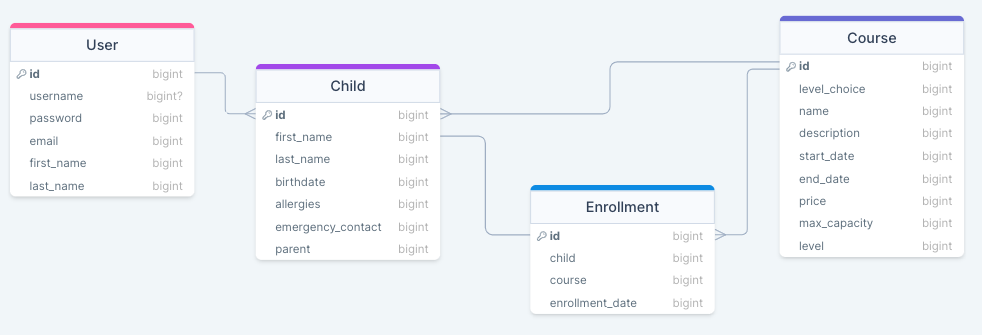
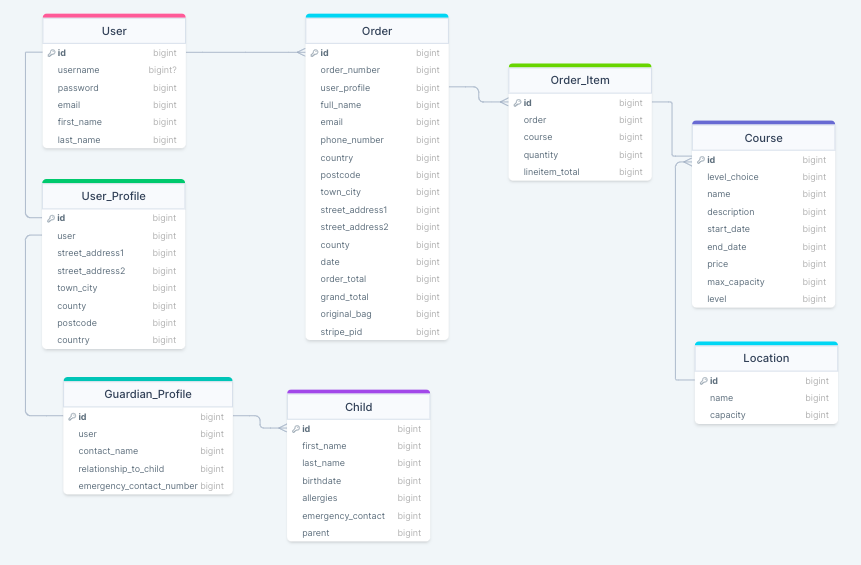
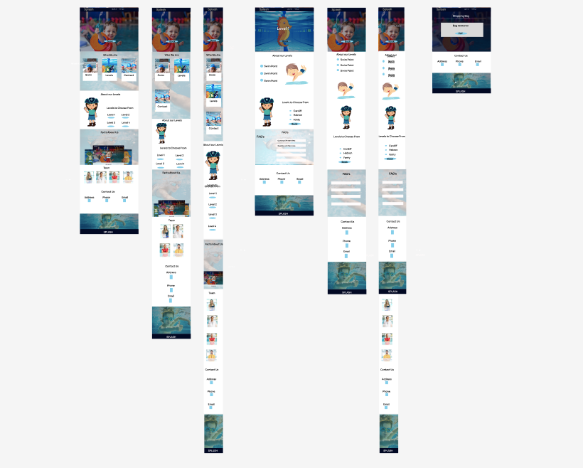
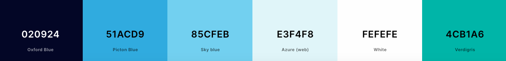
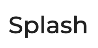
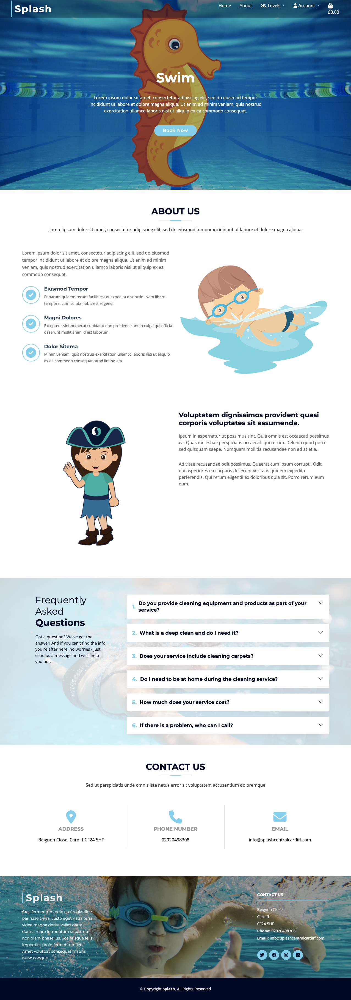
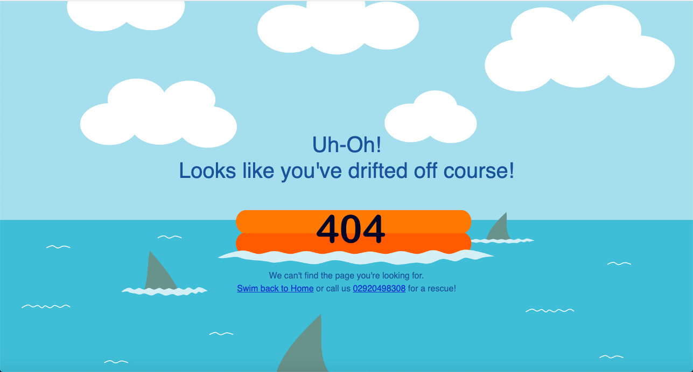
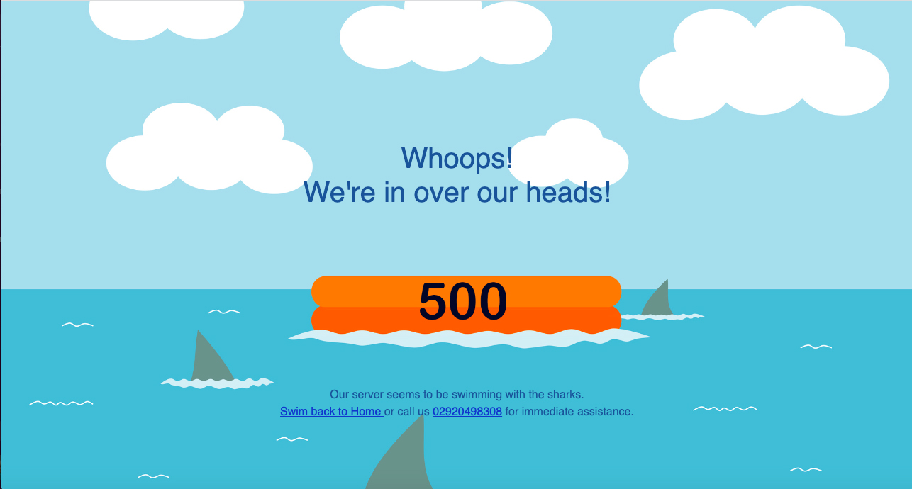
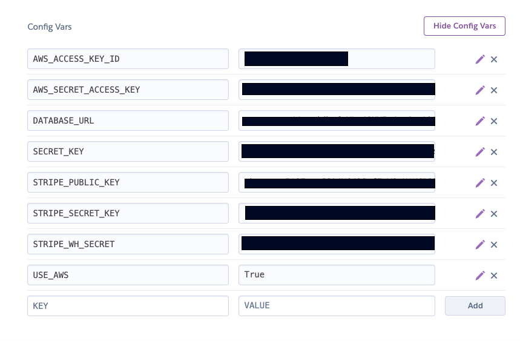

# Splash Swim School

<h1 align="center"></h1>

 Live website

 GitHub Repository

 Heroku Repository

# Welcome to Splash Swim School!

 Welcome to **Splash Swim School!** 
  

Founded by two dedicated mothers, Splash Swim School has evolved from its humble beginnings as a small local swim class into a remarkable institution exclusively focused on delivering high-quality swimming lessons for children of all skill levels. This exceptional swim school has not only flourished but has also emerged as the premier destination for parents seeking the best swimming education for their children.

  

Despite the impressive growth of Splash Swim School, their online presence has not kept pace with their physical expansion. With a limited online presence restricted to social media, Splash Swim School has now recognised the urgent need for a comprehensive website. This website will not only align with their brand identity but also enhance their daily operations by providing streamlined services to both parents and staff.

  

The Splash Swim School Website and Database System will be a web-based platform designed to streamline the registration process for parents and improve course management for the swim school. The system will allow parents to easily select and pay for swim courses, create parent and child profiles, and provide essential information. For the swim school, it will facilitate efficient course capacity & payment management, enrolment tracking, and access to crucial child details.

**The main Business Needs are:**

  

-   **Clear Course Information:** Splash Swim School needs a clear and concise method of communicating the specific swim levels they offer and defining the prerequisites for each level. This is crucial to ensure that only capable children are enrolled in appropriate courses and to prevent course swapping after the initial class which majorly impacts course capacity levels and the required staff to children ratios.  
    
-   **Streamlined Payment Process:** The school is seeking an efficient payment system that eliminates the need for persistent follow-ups with parents for class fees. Their goal is to receive full payment at the time of booking.  
    
-   **Standardised Child Information:** To enhance both insurance and operational aspects, Splash Swim School requires standardised child data. Currently, information provided by parents via email often lacks key details, leading to administrative efforts to collect missing information.  
    
-   **Flexibility in Level Changes:** The swim school needs the capability to facilitate course level changes for children according to their abilities. Some students may excel quickly and require advancement to higher levels early in their course and others may need the support of a lower course.  
    
-   **Enrolment Management:** Staff require the ability to remove a child from a class when necessary is essential for efficient management of course capacity levels.  
    

These business needs are not only aimed at improving the operational efficiency of the Swim School but are also designed to provide a more streamlined and informed process for parents, enhancing their overall experience. Addressing these business needs will optimise staff efficiency by reducing administrative hours spent on enrolment, payment tracking, and capacity management. This, in turn, will free up staff hours allowing the business to enhance lesson quality through increased teacher-to-child ratios.

## Table of Contents

- [User Experience (UX)](#UX)

- [Features](#features)

- [Technologies Used](#technologies)

- [Testing](#testing)

 - [Deployment](#deployment)

- [Credits](#credits)

## User Experience (UX)

## User Stories - 
- #### **Viewing and Navigation:**
    1. As a parent, I want to easily view the different swim course levels and their descriptions.
    2. As a parent, I want to see the prerequisites for each swim level to understand which level is suitable for my child and ensure i make the right choice.
    3. As an admin, I want a user-friendly dashboard to navigate and manage the swim school's website and database efficiently.
    
    
- #### **Registration and User Accounts:**
    1. As a parent, I want to register for an account to access swim course information.
    2. As a parent, I want to create a parent profile and add my child's information.
    3. As a parent, I want the ability to create multiple child profiles to account for siblings.
    4. As a parent, I want to be able to delete my parent profile and my Child's profile from the system. 
    5. As an admin, I want to ensure that certain fields are completed correctly and that partial or inaccurate parent and child profiles cannot be submitted. 
    6. As an admin, I need to know to be able to see what the child's information is linked to each enrolment. 
   

- #### **Purchasing and Checkout:**
    1. As a parent, I want to select and purchase a swim course for my child.
    2. As a parent, I want a streamlined payment process with the option to pay in full upon booking.
    3. As an admin, I want to track and manage payments, ensuring they are processed smoothly.
    4. As admin, i want to ensure that the course capacity is not exceeded and once full parents are unable to purchase that level of course. 
    
### User Stories - Business Owner
- #### **Admin & Course Management:**
    1. As an admin, I want to standardize and collect essential child information during registration.
    2. As an admin, I want the ability to change a child's swim level when they need to move up or down based on their progress.
    3. As an admin, I want to manage course capacity, track enrollments, and remove a child from a class when necessary.
    4. As an admin, I want to have a clear overview of enrollment, payment status, and capacity levels to improve course management.

## Design Choices

>### Structure Considerations
- #### Schema
    - Below is the reference table for the model schema that i originally created. Involving the parent profile who is able to create their child's profile along with the enrolment model that will communicate to the course model. 

        

    - Below is a more acurate reflection of how the model structure of this application has evolved. As referenced below in future iterations the enrolment model from above will be introduced and connected to the child profile along with a capacity model that connects directly to the enrolment model.

        

- #### Wireframes
    - After roughly sketching an idea of the rough structure and deciding that i wanted to keep the page format simple. I used Figma to really help simulate and hone in the simple structure. The wireframe process allowed me to create the main hero and see how i could re-use that in a seamless manner across the main pages giving brand continuity as well as marking individual components of the site. I used the Figma wireframe to identify the areas that required imagery and to ascertain what imagery worked well together. 

         

>### Aesthetic Considerations

- #### Colour scheme
    -  The colour scheme is inspired by the original logo which displays a navy colour alongside a light blue colour. I focused on these two colours opting for a darker navy to create more contrast on the site and improve readability in areas. The additional colours throughout the rest of the site are set to compliment these two key colours. Keeping the colour pallet quite simple was key in being able to use many colourful images within the design. The bright colours in the images stand out and pop with vibrancy and fun whilst the key colours and plain palette create a consistent and calm background meaning the design doesn't look too busy.

        
        

- #### Typography
    - Whilst considering typography for the site i deemed it necessary to keep the chosen fonts simple and clear with a slightly softer element to them in line with a site selling services for children. Montserrat felt like a good bold yet soft option for the logo and all headers using the complimentary Open Sans for the body font. The aim with these font choices was to achieve clear, accessible and fun text.

    - Montserrat
       
        

    - Open Sans

        

- #### Imagery
    - The use of imagery started with the business providing some images taken from their lessons. The boy squirting water with a smile on his face just summed up the joyful experience that these lessons can provide to children. From this i then opted for stock imagery (all credited in full below) that created a cohesive swimming pool look. The addition of the characters cut out and placed on top of the water provides that child friendly element without being too childish. This was an important fact for me to consider especially due to the fact that parents will be booking. When selecting imagery, including the vector images that tie in with the character levels i was very deliberate to try and capture imagery that represented gender equally, unfortunately i did not feel that the ethnic representation was balanced enough from the available imagery

>### Structure & Aesthetics Considered

- #### Mockups
    - Considering the initial database schema and the initial wireframe to indicate where the imagery should go the following more details mockups were created to ensure that the layout worked and to judge the text areas available for copy creation. 

        
        

## Features

### Existing Features
    
>#### Common Features Across All Pages
- **Favicon** - 
    - a favicon of the symbol used throughout the site is visible on the site tab so that all users can easily navigate back to the site with ease when multiple tabs are open. 
- **Header** - 
    - Provide instant impression on the user but simple structure so as not to distract.
    - I opted to use a slightly transparent navigation bar with a left aligned logo that links back to the home page. 
    - The navigation elements are on the right and all links behave in the same way.
    - The toggler provides the links to be displayed in a drop down manner on smaller view ports.
    - The navigation includes the levels broken down in a drop down format to enable the user to navigate swiftly to their level of choice. 
    - The navigation element also provides the user with quick reference to the bag total and allows the option to navigate to the checkout.
    - The navigation also provides the login/out elements for users. 
- **Accessibility**
    - The hamburger menu has aria-label added to let users with screen readers know where the toggleable menu is.
    - All colours have been contrast tested. The hamburger item has been wrapped in a blue to highlight and create more contrast. 
- **Buttons**
    - The same hover transition and colours have been applied to the buttons across all pages in order to create a cohesive look and make the call to action clear and easy to find. The font is the same for all buttons.
    - When two buttons are close together one has been maintaned as a button and the other changed to an icon or a link to assist the user in differentiating between the two. 
- **Responsiveness**
    - All Pages have been built around Bootstrap 5'S responsive grid layout and provide the same functionality regardless of the viewport size,
- **Footer**
    - The footer consistent through the site provides an additional navigation option thought to be helpful on the longer pages. 
 - **Custom Error Pages**
    - Custom 404 page to redirect the user when they try to access a non existent or removed page. This presents the user with the option to navigate home or provides the number for the the customer to call splash directly. 

        

    - Custom 500 server issue page to catch customers when server issues are experienced.  This presents the user with the option to navigate home or provides the number for the the customer to call splash directly. 

        

>### Specific to Pages
-  **Index/Home**
    - Swim with us - a welcoming intro on what to expect from the site that provides a quick link to book now for those visitors arriving with that instant intent. 
    - Who we are - This section gives the business a chance to introduce themselves and provide a quick overview of the information contained lower down through the page allowing the user to skip to the information they want to read.
    - Swim levels - This section provides a chance for the business to explain why they have different levels but also to  identify what those levels are. This section also provides a book now button to enable the user to initiate their customer journey. 
    - Splash facts allows a small space for the business to promote the facts and figures it is most proud of. this has been added to help create a sense of trust with new customers.
    - Meet out team enables parents to see who is teaching their children and also allows the parents to introduce the teacher to the child ahead of time helping with assurance and nerves starting a new course. 
-  **Levels 1-4**
    - Level Identification allowing the user to see that they are on the correct page instantly
    - Level explanation along with the specific guide for parents in regards to the ability level required before booking said level. This is to help combat children being booked on to courses that are beyond their ability or not challenging enough. 
    - Course times information followed by a display of all of the courses available at that level including their location information. with radio buttons to allow the course to be selected and added to the bag
    - FAQ's unique to each level answering any doubts or queries the user may have that is preventing them from purchasing. This feature should help relieve the demand on the admin and reception staff.
    
-  **Bag**
    - Displays bag information and enables users to delete the course in their bag or navigate to the checkout.
    - One course can be purchased at a time to encourage users to log in and create their child profile information, this will be vital to the enrolment model when it is implemented. The user can return to the home page and purchase another separately. The bag automatically swaps the course in its bag to the next purchased course but warns the user that this has happened. 
  -  **checkout**
		- Provides the form to enable the capture of data for the purchase of a course using STRIPE.
		- Provides an order summary allowing the user to check they are purchasing the correct course. 
  -  **Profile**
		- Presents the user with an oportunity to update the contact details associated with their account for future purchases.
		- Provides the user with an overview of their purchases.
		- Invites the user to create a Guardian profile in order to provider in case of emergency contact.
		- Child profile form inputs that allow the user to create child profiles linked to the guardian information. This enables the user to provide critical information directly to the business that will help to keep the children swimming safe. 
		- Child profile displays mean that you can clearly see the information supplied and presents the user with the option to update and delete each child profile individually. 
-  **login**
    - login form
    - links to sign up 
-  **sign up**
   - sign up form

>#### Features that assist in the Customer/Parent Journey 

- **Clear Home Page Structure** detailing all of the information that you need to know about the facility including location, team members and the founders story with facts and figures to ensure the parent builds trust in Splash. The top of the home page introduces the fact that swim courses are taught through different levels. This moves the customer down into a section where they can identify the four different levels and click through to investigate further and book. 
- **Individual Level Pages** provided for all 4 levels. This allows the customer a deep dive into the level of swimming taught at each level. The detailed section stipulating what your child must be able to do before entering this level helps the customer/parent choose the correct level of class for the child's ability reducing the potential for the incorrect level to be booked which in turn saves time business time and resources and confusion for the child. 
The text above the courses available to book, instructs the purchaser that in order to confirm enrolment they will be invited to create a profile for their child. This section stipulates 'Only once your child’s profile is complete will their enrolment in the class be confirmed. Failure to complete your child’s profile will result in your child being removed from the class list and potentially loosing their slot.' This creates urgency and a need for the parent to follow through and create the child profile for the swimmer.
- **Success Purchase Toast** This pop up provides the invite and reminder to the parent that they now need to log in/create an account and create their child's profile in order to confirm their place on the course. 
Once the child's profile is added the admin team would manually check the details and email out all of the relative confirmation information to the customer/parent. 
- **Profile Headers** The Swimming Safely and Child Profiles section headers convey the importance of each section to the customer encouraging them to complete them fully. 

## Splash Swim School Future Iterations

- The next step in the process of overhauling Splash Swim Schools online presence and business flow will be to connect emails and ensure that the collection of data complies with GDPR. This will potentially mean adding additional check fields into the registration process. The ability to send confirmation emails and course update emails will be vital to the business. 

- In the next phase of development for this project, a pivotal enhancement will be the integration of the enrolment and course capacity models. These additions should seamlessly connect each child's profile to specific course product, offering a clear and efficient view of each class makeup within the admin but also allowing the user to directly see which class product their child is currently enrolled on. The child profile will contain the course name on the right hand side of the accordion. 
By strategically placing key elements within our existing models, such as `ChildProfile` and `GuardianProfile`, and linking these to the proposed `EnrolmentModel`, we pave the way for a smooth business management as course capacities will be automatically managed, mitigating the risk of overbooking and ensuring optimal class sizes. Furthermore, this advancement will provide teachers with easier access to the vital information about the children in their classes that is already stored within the admin view. This greatly enhances the safety and personalisation of the swim school's services. 

- Once the enrolment and capacity models are in place and email GDPR checks are active the third iteration would be to enable the management to upload the individual swimmers reports to the child's profile so that the user can login to view their child's progress. This process is currently done manually by email or by parents asking at the reception desk. This feature would greatly enhance the parents interaction with the service but also dramatically cut admin time. 

## Technologies Used

>### Languages Used

- [HTML5](https://en.wikipedia.org/wiki/HTML5)
- [CSS3](https://en.wikipedia.org/wiki/Cascading_Style_Sheets)
- [JavaScript](https://www.javascript.com/)
- jQuery 
- Python - Providing the main backend development for this application.
   - asgiref==3.7.2
   - asgiref==3.7.2
   - boto3==1.33.9
   - botocore==1.33.9
   - dj-database-url==0.5.0
   - Django==3.2
   - django-allauth==0.41.0
   - django-countries==7.2.1
   - django-crispy-forms==1.14.0
   - django-storages==1.14.2
   - gunicorn==21.2.0
   - jmespath==1.0.1
   - oauthlib==3.2.2
   - psycopg2==2.9.9
   - python3-openid==3.2.0
   - pytz==2023.3.post1
   - requests-oauthlib==1.3.1
   - s3transfer==0.8.2
   - sqlparse==0.4.4
   - stripe==7.5.0
   - urllib3==1.26.18

>### Frameworks, Libraries, Programs, Online Resources Used

- [Git](https://git-scm.com/) 
- [GitPod](https://www.gitpod.io/) 
- [ElephantSQL](https://www.elephantsql.com/) Database management
- [Heroku](https://heroku.com/) Hosting project application
- [StackEdit](https://stackedit.io/) used to assist with markdown and structure
- [Lucid](https://lucid.app/) used to create database flow
- [DrawSQL](https://drawsql.app/) used to visualise the database structure
- [Django Allauth](https://docs.allauth.org/en/latest/) used to help integrate the Allauth user authentication
- [Cripsy Forms documenation](https://django-crispy-forms.readthedocs.io/en/latest/) Used to familarise myself further with the use of crispy forms within the application. 
- -  [# Geeks for Geeks](https://www.geeksforgeeks.org/django-templates) Used to help me better understand Django template format & for loops. 
- [Github](https://github.com/) 
- [Bootstrap v5.3](https://getbootstrap.com/) - Responsive Elements Hero, navigation, buttons & cards.
- [Bootstrapmade](https://bootstrapmade.com/) - Bootstrap template site - used to form the base HTML & CSS for structure of the site. The following sections were taken for the following templates, stripped and edited to sit in line with the site design and layout. 
                - Bizpage - Hero CSS - Contact Us - Footer
                - Newbiz - Level1-4 Main content structure
                - Yumy - Who we are svg and Team SVG Wave
- [jquery](https://jquery.com/) - Used for the toggle function in the navigation
- [Google Fonts](https://fonts.google.com/) - Montserrat, Open Sans
- [Font Awesome](https://fontawesome.com/) - icons.
- [Photoshop](https://www.adobe.com/ie/products/photoshop.html) - images have been created, resized and edited within photoshop.
- [Coloors](https://coolors.co/) - Used to create the colour palettes and identify complimentary and contrasting colours. This was also used to check the accessibilty of the text colour with each background colour during the planning stage. 
- [RGBA Color Picker](https://rgbacolorpicker.com/hex-to-rgba) - to match hex colours to an RGBA so that i could change the apacity accurately.
- [Splash Central Business] - Images provided directly from the Splash Business.
     - Index Hero
     - Splash Characters
             - Pirate
             - Seahorse
             - Frog
             - Killer Whale
             - Dolphin
- [Istock](https://www.istockphoto.com/)- Istock used for all imagery within the site.
    - [Hero background for levels & level progressions](https://www.istockphoto.com/photo/swimming-pool-underwater-gm680734306-124765485?clarity=false) - Image by ASKA
    - [Who We Are - Facts & FAQ Background](https://www.istockphoto.com/photo/little-girl-swimming-freestyle-in-a-swimming-pool-gm1485454176-511442078?clarity=false) - Image by Imgorthand
    - [Footer Background](https://www.istockphoto.com/photo/child-whit-thumb-up-diving-underwater-gm1298622398-391449200?clarity=false) - Image by StockPlanets
    - [Who We Are - Swim](https://www.istockphoto.com/photo/male-swimming-coach-giving-boy-holding-float-one-to-one-lesson-in-pool-gm1167733659-322143046?clarity=false) - Image by MonkeyBusinessImages
    - [Who We Are - Find Us](https://www.istockphoto.com/photo/female-coach-in-water-giving-group-of-children-swimming-lesson-in-indoor-pool-gm1167733673-322143051?clarity=false) - Image by MonkeyBusinessImages
    -  Levels Vector Images
           - [Level 1](https://www.istockphoto.com/vector/little-child-jumping-gm889167860-246554022?clarity=false) - Image by Pijama61
            -   [Level 2](https://www.istockphoto.com/vector/girl-diving-at-sea-gm889168522-246554031?clarity=false) - Image by Pijama61
            -  [Level 3](https://www.istockphoto.com/vector/kid-swimming-gm889168470-246554028?clarity=false) - Image by Pijama61
            -   [Level 4](https://www.istockphoto.com/vector/cartoon-kid-swimming-on-a-white-background-little-boy-swimmer-in-the-swimming-pool-gm1226259883-361246654?clarity=false) - Image by Pijama61
    -  Team images
           - [Level 1 Teacher](https://www.istockphoto.com/photo/portrait-of-female-coach-standing-with-arms-crossed-near-poolside-gm1009776872-272212512?clarity=false) - Image by Selcebu
            -   [Level 2 Teacher](https://www.istockphoto.com/photo/swimming-coach-with-a-wistle-and-stopwatch-posing-in-an-indoor-swimming-pool-gm1422360253-467670429?clarity=false) - Image by Ljupco
            -  [Level 3 Teacher](https://www.istockphoto.com/photo/female-swimming-coach-with-a-wistle-and-stopwatch-around-her-neck-posing-inside-an-gm1426309365-470551808?clarity=false) - Image by Ljupco
            -   [Level 4 Teacher](https://www.istockphoto.com/photo/portrait-proud-and-coach-at-a-swimming-pool-for-training-exercise-and-practice-at-gm1486027348-511877271?clarity=false) - Image by Peopleimages
    - [404 & 500 background image](https://www.istockphoto.com/vector/drifting-life-raft-and-shark-fins-in-the-sea-water-gm1295581514-389260868?clarity=false) - Image by MAHIJO
   
- [Figma](https://www.figma.com/file/ladBUkKqWA50bv0xDRaMUH/SPLANETS?node-id=0%3A1&t=rRbFBuY40vnsdoR4-1) used to create mock up designs
- [amiresponsive](https://ui.dev/amiresponsive) Used to create the live image capture of site
-  [Make Use Of](https://www.makeuseof.com/create-custom-404-error-page-django/) Used as a guide to build the 404 & 500 error pages. 
- [Regex Generator](https://regex-generator.olafneumann.org/?sampleText=07891547662&flags=i&selection=0%7CNumber) used to help familiarised myself with Regex code and trial generating UK phone number code. 
- [Regex Library](https://regexlib.com/Search.aspx?k=uk+phone&AspxAutoDetectCookieSupport=1) Assisted with guiding me with the available uk phone number formats.
- [Django ORM - Model Field Validators / Writing Custom Validators / ModelForms](https://www.youtube.com/watch?v=1x0Zdukpjrs) Youtube video by **By BugBytes** regarding creating custom form validators.

## Testing

>Please refer to [TESTING.md](TESTING.md) document

## Deployment

This project was created using the Code Institute Full template. Follow the link and select https://github.com/Code-Institute-Org/gitpod-full-template and then use this template and follow the normal steps to creating a new repository. 

>### Publishing
This website was published using [GitHub Pages] ElephantSQL & Heroku (https://pages.github.com/). The procedure is outlined below.
1. Navigate to ElephantSQL.com and click “Get a managed database today”
2. Select the relevant option - we currently have the Tiny turtle free plan.
3. Select “Log in with GitHub” and authorize ElephantSQL with your selected GitHub account
4. In the Create new team form:
    - Add a team name (your own name is fine)
    - Read and agree to the Terms of Service
    - Select Yes for GDPR
    - Provide your email address 
    - Click “Create Team”
5.  Create Database, Click “Create New Instance” & set up your plan;
    - Give your plan a Name (this is commonly the name of the project)
    - Select the Tiny Turtle (Free) plan
    - You can leave the Tags field blank
6. Select “Select Region”, Select a data center near you then click “Review”
7. Check your details are correct and then click “Create instance”
8. Return to the ElephantSQL dashboard and click on the database instance name for this project
9. In the URL section, clicking the copy icon will copy the database URL to your clipboard

>### Deploying with Heroku

1. In GitPod CLI, the root directory of the project, run:
    pip freeze --local > requirements.txt
    to create a requirements.txt file containing project dependencies.
2. Create Procfile folder ensuring capital P in the route directory.
     - Enter web: python run.py within the file
     - Ensure you do not add a blank line to the end of the file as this can cause problems for deployment.
3. Push your two 2 new files to your GitHub repository
4. Login to Heroku, select Create new app, add the name of your app and select your nearest region.
5. Go to the settings tab, click reveal config vars and input the following:

    

6. Ensure NOTE to enter DEVELOPMENT and DB_URL from the env.py file as a Config Var. 
7. Go to the “Deploy” tab of your app In the Deployment method section, select “Connect to GitHub
8. Search for your repository 
9. You now have the option to select 'Enable Automatic Deploys'
10. Click deploy Main
11. click the “More” button and select “Run console this is to migrate the tables from our database;
      - Type python3 into the console and click Run
      - from notemanager import db
      - db.create_all()
      - exit()
      - Please note any additional changes will need to be migrated.

>### Forking
If you wish to contribute to this website you can Fork it without affecting the main branch by following the procedure outlined below.
1. Navigate to the relevant GitHub Repository
2. Click on the 'Fork' button at the top right of the page
3. This will duplicate the project for you to work on

>### Cloning 
If you wish to clone or download this repository to your local device you can follow the procedure outlined below.
1. Navigate to the relevant Got Hub Repository
2. Click on 'Code' and then 'Download Zip' from the drop down. You can then open with an IDE or Copy the URL from the top box
3. If copying the code open your development editor & in the terminal use the 'Git Clone' command followed by the above URL to create a clone of the project locally.

## Credits

>### Code 

- The core of the application has been derived from the code Institute Relational Database Walkthrough Boutique Ado and amended to fit the needs of my application. I tried to make a strong distinction within the structure of the site to clearly mark the difference and try to challenge myself to adapt the walkthrough. The areas that are less distinguished are that of the bag, Checkout app, Stripe and initial User Profile. 
- [Bootstrapmade](https://bootstrapmade.com/) - used as an alternative to the Bootstrap Library to form the base HTML & CSS for structure of the site. The following sections were taken for the following templates, stripped and edited with custom CSS and additional HTML to sit in line with the site design and layout.
	- Bizpage Template- Hero CSS - Contact Us - Footer
	- Newbiz Template- Level1-4 Main content structure
	- Yumy Template- Who we are svg and Team SVG Wave
-  I have used the the following resources to help me structure and formulate my approach to filtering the available products to the set levels. Please note that my code was inspired by not copied from. 
		- [# Elevate Your Django Filtering](https://python.plainenglish.io/elevate-your-django-filtering-game-crafting-expert-level-filtersets-30f4dac7d9a6)
		- [# Django Ecommerce Part 5 | Fetch products by category in django](https://www.youtube.com/watch?v=Bs_FtLv38Fw)
		-  [# Django Rest Framework](https://www.django-rest-framework.org/api-guide/filtering/)
    

- Styling of Radio Input taken from the basis provided within https://stackoverflow.com/questions/4253920/how-do-i-change-the-color-of-radio-buttons
- JS to activate the messages via toast is my custom js. all the rest of the JS code is that from the walkthrough.
- - Assistance received from **Roman Rakic** Code Institute tutor who gave guidance via Slack on resolving issues with the 404 & 500 page builds and also assisted with providing information on how to link to an external background image for the 500 page.
- Assistance received from **Niki Tester** CI Alumni via slack providing the logic to break down Line 145 in the webhook_handler.py
- All of the rest of the code was written by the author - Philippa Ellis

>### ReadMe Resources
- [Markdown Cheatsheet](https://github.com/adam-p/markdown-here/wiki/Markdown-Cheatsheet#code)
- Code Institute [SampleREADME](https://github.com/Code-Institute-Solutions/SampleREADME)
- Slacks numerous Markdown questions and answers
- [Stack Edit](https://stackedit.io) in browser markdown editor