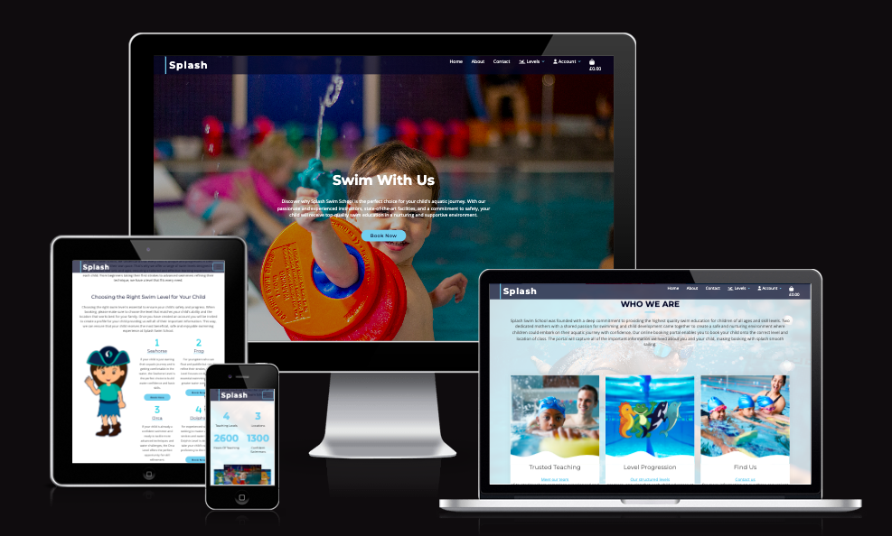
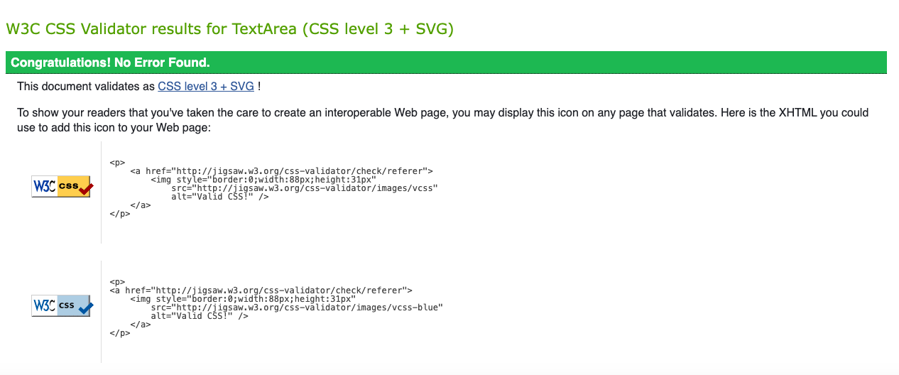
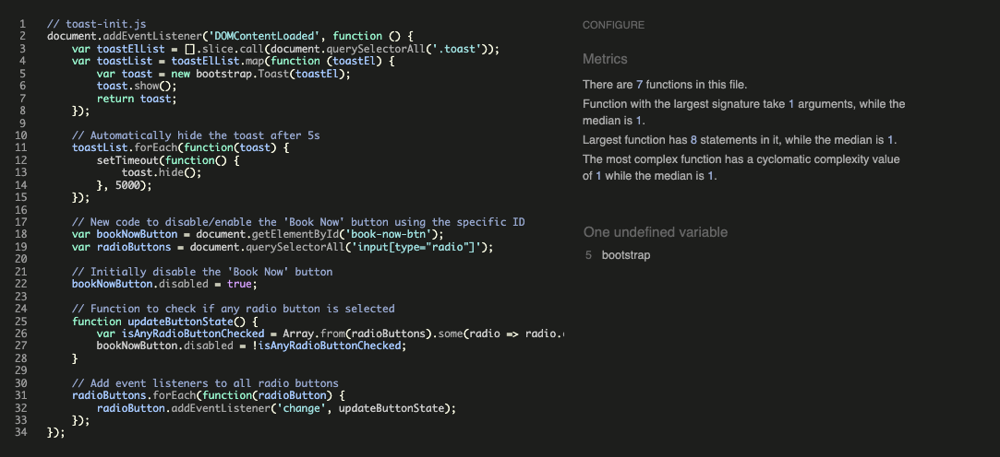

# Splash Swim School - Testing

## Table of Contents

- [Test Record](#testrecord)
- [CSS3 Validator](#css)
- [HTML5 Validator](#html)
- [JavaScript Validator](#js)
- [Python Validator](#python)
- [Accessibility](#access)
- [Compatibility](#compatibility)
- [Performance](#performance)
- [User Story](#user)
- [Known Bugs](#bugs)

## Test Record :
**TEST** | **ACTION** | **EXPECTATION** | **RESULT** 
----------|----------|----------|----------
 Home page | Size to 320px using Chrome Dev Tools	| Elements look good @ 320px | Works as expected
Home page | Size to 1920px using Chrome Dev Tools | Elements look good 1920px | Works as expected
Home page | Size to 990px using Chrome Dev Tools | Navbar to toggle | Works as expected
Home page | Scroll action | NavBar Scrolls with user | Works as expected
Home page | Header Nav links clicked |  User taken to respective correct pages | Works as expected
Home page | Size to 990px & Toggle Nav links clicked |  User taken to respective correct pages | Works as expected
Home page |Header Logo Text clicked | User taken to Home page | Works as expected
Home page | Book Now Button clicked | Take user to levels and book section | Worked as expected
Home page | All three links clicked on who we are section | Take user to correct sections of the site respectively | Worked as expected
Home page | Book Now buttons clicked in the Swim Levels section | Take user to relevant level page all 4 tried | Worked as expected
Home page | Haeding links clicked in the Swim Levels section | Take user to relevant level page all 4 tried | Worked as expected
Home page | About link clicked in Nav | Take user to About section | Worked as expected
Home page | Contact link clicked in Nav | Take user to Contact section | Worked as expected
Level page1 | Size to 320px using Chrome Dev Tools	| Elements look good @ 320px | Works as expected
Level page1| Size to 1920px using Chrome Dev Tools | Elements look good 1920px | Works as expected
Level page1 | Book Now button clicked  | Take user to the course selection section | Worked as expected
Level page1 | Size to 990px using Chrome Dev Tools and toggle links clicked | NavBar to toggle and links take user to respective correct pages | Works as expected
Level page1 | FAQ's Section  | Accordions collapse and revert correctly| Works as expected
Level page1 | Scroll action | NavBar Scrolls with user | Works as expected
Level page1 | Header Nav links & Logo Text clicked |  User taken to respective correct pages | Works as expected
Level page1 | Course selection Radio selects and Book Now button clicked |  correct course added to bag | Works as expected
Level page1 | Course selection Book Now button clicked without Radio selection |  book now button disabled | Works as expected
Level page2 | Size to 320px using Chrome Dev Tools	| Elements look good @ 320px | Works as expected
Level page2| Size to 1920px using Chrome Dev Tools | Elements look good 1920px | Works as expected
Level page2 | Book Now button clicked  | Take user to the course selection section | Worked as expected
Level page2 | Size to 990px using Chrome Dev Tools and toggle links clicked | NavBar to toggle and links take user to respective correct pages | Works as expected
Level page2 | FAQ's Section  | Accordions collapse and revert correctly| Works as expected
Level page2 | Scroll action | NavBar Scrolls with user | Works as expected
Level page2 | Header Nav links & Logo Text clicked |  User taken to respective correct pages | Works as expected
Level page2 | Course selection Radio selects and Book Now button clicked |  correct course added to bag | Works as expected
Level page2 | Course selection Book Now button clicked without Radio selection |  book now button disabled | Works as expected
Level page3 | Size to 320px using Chrome Dev Tools	| Elements look good @ 320px | Works as expected
Level page3| Size to 1920px using Chrome Dev Tools | Elements look good 1920px | Works as expected
Level page3 | Book Now button clicked  | Take user to the course selection section | Worked as expected
Level page3 | Size to 990px using Chrome Dev Tools and toggle links clicked | NavBar to toggle and links take user to respective correct pages | Works as expected
Level page3 | FAQ's Section  | Accordions collapse and revert correctly| Works as expected
Level page3 | Scroll action | NavBar Scrolls with user | Works as expected
Level page3 | Header Nav links & Logo Text clicked |  User taken to respective correct pages | Works as expected
Level page3 | Course selection Radio selects and Book Now button clicked |  correct course added to bag | Works as expected
Level page3 | Course selection Book Now button clicked without Radio selection |  book now button disabled | Works as expected
Level page4 | Size to 320px using Chrome Dev Tools	| Elements look good @ 320px | Works as expected
Level page4 | Size to 1920px using Chrome Dev Tools | Elements look good 1920px | Works as expected
Level page4 | Book Now button clicked  | Take user to the course selection section | Worked as expected
Level page4 | Size to 990px using Chrome Dev Tools and toggle links clicked | NavBar to toggle and links take user to respective correct pages | Works as expected
Level page4 | FAQ's Section  | Accordions collapse and revert correctly| Works as expected
Level page4 | Scroll action | NavBar Scrolls with user | Works as expected
Level page4 | Header Nav links & Logo Text clicked |  User taken to respective correct pages | Works as expected
Level page4 | Course selection Radio selects and Book Now button clicked |  correct course added to bag | Works as expected
Level page4 | Course selection Book Now button clicked without Radio selection |  book now button disabled | Works as expected
Bag |Size to 320px using Chrome Dev Tools	| Elements look good @ 320px | Works as expected
Bag |Size to 1920px using Chrome Dev Tools | Elements look good 1920px | Works as expected
Bag |Size to 990px using Chrome Dev Tools and toggle links clicked | NavBar to toggle and links take user to respective correct pages | Works as expected
Bag  | Header Nav links & Logo Text clicked |  User taken to respective correct pages | Works as expected
Bag | Bag empty Clicks Keep shopping | Takes User to home page | Works as expected
Bag| contents added  | displays course information  | Works as expected
Bag| contents added delete button selected  | Course removed from bag with success message  | Works as expected
Bag| contents added check out button selecetd | User passed to checkout  | Works as expected
Checkout | All sizes checked using Chrome Dev Tools	| Elements look good @ all sizes | Works as expected
Checkout | Form inputs filled out | All forms accept their inputs | Works as expected
Checkout| STRIPE test payment used | Purchase completes |Works as expected
Checkout| Review order information | correct course information displayed |Works as expected
Checkout Success | All sizes checked using Chrome Dev Tools	| Elements look good @ all sizes | Works as expected
Checkout Success | purchase made | information populated correctly on checkout success page | Works as expected
Checkout Success | button sleected to find out more about splash | takes user to home page |Works as expected
Profile | All sizes checked using Chrome Dev Tools	| Elements look good @ all sizes | Works as expected
Profile |User Logged in - clicks to access | user can access profile |Works as expected
Profile |User not Logged in | No profile option available |Works as expected
Profile |User Logged in information fields updated | information updated |Works as expected
Profile |User Logged in | order history correctly shown |Works as expected
Profile |User Logged in information inputed to Guradian Profile| Guardian profile information saved |Works as expected
Profile |User Logged in information edited in field | Guardian profile updated information saved |Works as expected
Profile |User Logged in Guardian profile deleted| modal activated information daleted and all related child profiles deleted |Works as expected
Profile |User Logged in information inputed to Child Profile| Child profile information saved |Works as expected
Profile |User Logged in Child profile update btn clicked | child profile edit view opened and ability to save or cancel |Works as expected
Profile |User Logged in Child profile deleted| modal activated information daleted and all related child profiles deleted |Works as expected
Login page| All sizes checked using Chrome Dev Tools	| Elements look good @ all sizes | Works as expected
Login page| Header Nav links & Logo Text clicked |  User taken to respective correct pages | Works as expected
Login page| User inputs valid username and password | User taken to home page successful login message displayed | Works as expected
Login page| User inputs valid username and password | Navigation bar options for profile and admin management become available | Works as expected
Login page| User inputs in-valid username and password | Flash message appears to highlight they have entered an invalid username or password  | Works as expected
Sign Up page| All sizes checked using Chrome Dev Tools	| Elements look good @ all sizes | Works as expected
Sign Up page| Header Nav links & Logo Text clicked |  User taken to respective correct pages | Works as expected
Sign Up page| User inputs username and password | user redirected to login page saying success and inviting them to use their new credentials to login | Works as expected - Database checked password is successfully hashed
Logout NavBar Button| Logged in user clicks to logout | User logged out and redirected to the the confirmation sign out page | Works as expected
Sign Out Page | Logged in user clicks to sign out | User is signed out and redirected to home and confirmation message appears | Works as expected

## CSS3 validator - Pass
Files Tested 
 - base.css
 - profile.css

## HTML5 validator
each file tested individually not utulising the page source due to the fact the templating in the nav was throwing off the error reports. 
- base.html - Testing by copying content of html over from the html file directly. Only warnings received due to static urls and templating.
- index.html - Passed using HTML from View Page Source to remove Jinja Templating and Statci urls (flags up issues with the nav which is inherited from the base - no issues with these elements when testing the Nav).
- level1.html - Passed using HTML only - only warnings created when picking up static urls and templating logic.
- level2.html - Passed using HTML only - only warnings created when picking up static urls and templating logic.
- level3.html - Passed using HTML only - only warnings created when picking up static urls and templating logic.
- level4.html - Passed using HTML only - only warnings created when picking up static urls and templating logic.
- bag.html - Passed using HTML only - only warnings created when picking up static urls and templating logic.
- checkout.html - Passed using HTML only - only warnings created when picking up static urls and templating logic.
- checkout_success.html - Passed using HTML only - only warnings created when picking up static urls and templating logic.
- profile.html - Passed using HTML only - only warnings created when picking up static urls and templating logic.
- update_child_profile - Passed using HTML only - only warnings created when picking up static urls and templating logic.

## Javascript validator
- Reported Metrics - custom.js
There are 7 functions in this file.

Function with the largest signature take 1 arguments, while the median is 1.

Largest function has 8 statements in it, while the median is 1.

The most complex function has a cyclomatic complexity value of 1 while the median is 1.

One undefined variable line 5 bootstrap

No Warnings

- I have run the stripe_elements.js code taken from the CI boutique ado source code. This gives out a warning of 118	Missing semicolon. I have not amended this as i have not wanted to interupt the working given code that has been copied over from the walkthrough. 

## Python validator

**splash**
- urls.py - All clear, no errors found
- settings.py - All clear, no errors found
- asgi.py - All clear, no errors found
- wsgi.py - All clear, no errors found

**profiles**
- admin.py - All clear, no errors found
- forms.py - All clear, no errors found
- models.py - All clear, no errors found
- urls.py - All clear, no errors found
- views.py - All clear, no errors found

**products**
- admin.py - All clear, no errors found
- apps.py - All clear, no errors found
- models.py - All clear, no errors found
- urls.py - All clear, no errors found
- views.py - All clear, no errors found

**locations**
- admin.py - All clear, no errors found
- apps.py - All clear, no errors found
- models.py - All clear, no errors found

**home**
- apps.py - All clear, no errors found
- urls.py - All clear, no errors found
- views.py - All clear, no errors found

**checkout**
- admin.py - All clear, no errors found
- apps.py - All clear, no errors found
- forms.py - All clear, no errors found 
- models.py - All clear, no errors found
- signals.py - All clear, no errors found
- urls.py - All clear, no errors found 
- views.py - All clear, no errors found 
- views.py - All clear, no errors found

**bag**
- apps.py - All clear, no errors found
- contexts.py - All clear, no errors found
- urls.py - All clear, no errors found 
- views.py - All clear, no errors found

## Accessibility

### Lighthouse testing
- At the time of testing Lighthouse would not complete its warm up on the local server or the Heroku deployed app so wave was utilised instead

### Wave testing
- Wave testing highlighted several contrasting issues throughout with the light blue against the white. This branding is pivitol to the site and getting user feedback nobody from the target audience have had issues with the general contrast. This is definitely something to take into consideration in the future when the team do any further rebranding.  
- Wave testing has identified errors in reagrds to the blank social media links and the templating nav links. 

## Compatibility Testing
- Browser Compatibility tested via [Browser Stack](https://live.browserstack.com/) 
- tested on the latest versions of the following
    | Safari    | Firefox   | Chrome  | Opera  | Edge  |
    | --------- |:---------:| -------:| ------:| -----:|
    | Pass      | Pass      | Pass    | Pass   | Pass  | 
    
- Chrome developer tools has been used to check the responsiveness of the site across different screen sizes and devices. 
- The site has mostly been built and tested on a Macbook Air operating on MacOs Catalina.

## Performance Testing
-  The performance of the site was tested on the following site with satisfactory results. [Web Page Test](https://www.webpagetest.org)

## Testing User Stories 
>### External testing
- All testers confirmed that they coud sign up, login and logout.
- All testers confirmed that all buttons and navigation links performed the correct function.
- All testers confirmed that the forms submitted on the checkout, child and guardian profiles displayed correctly.
- All testers confirmed that they could, update and delete the relevant sections of the Guardian and Child Profiles.

- 
>### User Stories - Customer
- From user story - Viewing and Navigation:;
    - The parent is able to view all of the specific information about a level and them whilst on the same page is able to select to book. 
    - The prerequisites for each level are provided at the top of the swimming level page. Clear for everyone to see. This information is also reinforced within the FAQ's section.
    - The admin can log in add courses, link them to locations. They can go in and change the level in the admin of the purchased product should the child need to move groups. The amdmin are able to see the pertinent child information and the most importantly mediaction and in case of emergency details. 

- From user story - Registration and User Accounts;
    - The parent can register an account and can view their order history. 
    - The parent is able to create profiles for their children.
    - The parent has the abilty to create multiple children accounting for siblings.
    - The parent is able to delete their and their childrens information from the account easily. 
    - The forms are set to require completion.
    - The format and structure of the application allows the course order to be matched to a user profile which is then linked to a child profile. The full realisation of this user story will be complete when the enrolment and capaity models are added. 

- From user story - Purchasing and Checkout;
    - Parents can select the course of choice from the correct swim level and purchase it for their child. 
    - Parents have access to the streamlined STRIPE payment format. 
    - admin have the ability to track orders. 
    - the capacity for locations has been set but this user story will not be fully complete until the enrolment and its connected capacity model is created. 

>### User Stories - Business Owner -Admin & Course Management
-  All the relevant information is collected from the child profile and linked to a guardian so that all ability, age, health and emergency contact information is displayed easy to hand. 
- Admin have the ability to edit orders abd swap the course_level
- The addition of the enrolment and capacity models will enable automatic manaagement of course capacity. Currently the course capacity is set to the capacity at the venue and will be manually managed by the admin staff. 

## Known Bugs

- No known bugs.  

## Bugs & challenges experienced during the build

- I personally found the placement of the elements within the for loops and if else elements within the html templates tricky. The second child profile to be added did not inherit the normal bootsrtap Accordion styling. I discovered that i was starting the for loop inside the accordion elemey instead of outside of encaplutaing the form. 

- Toasts error due to the conflict between the latest bootstrap not requiring jQuery - I ended up using custom javascript to initialise the toast messages.

- Error thrown when user clicked the book now button to purchase a course without selecting a radio button against a course product. This was righted with custom JS to disable the book now button until a radio button is selected.

- The more complex hero sections with forms in them on the checkout and profile pages were displaying no margin top on smaller screen sizes making the header and paragraph text unreadable. They were also scrolling vertically but i could not get the background image to cover leaving an overlap and blank space on scrolling. This caused me great frustration and in the end I opted to replace the more complex container structure with a simple container and upload an additional background images that contained the overlay from the previous containers. These containers mow display all of their content and the image stretches approproiately on smaller screen sizes. 